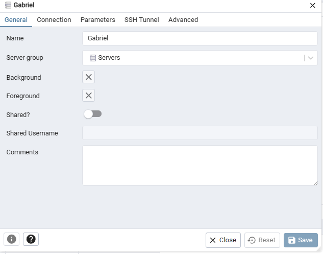

<!-- PARA VER TABLAS EN POSTGRES -->
$ docker-compose exec postgres bash
root@1d4ea7a85614:/# psql -h localhost -d db_gacho_store -U gacho
db_gacho_store=# \d+

% NODE Y POSTGRES
% https://node-postgres.com/

% INSTALAMOS EL DRIVER DE POSTGRES
npm install pg 

% BUSCAR CHEATSHEET PARA COMANDOS EN TERMIAL

# Configuración de Docker Compose para PostgreSQL y pgAdmin

Para solucionar los problemas mencionados y seguir las recomendaciones de los comentarios, puedes modificar tu archivo `docker-compose.yml` de la siguiente manera:

## Cambios realizados

1. **Utilizar el nombre del contenedor en vez de la dirección IP**:
   - Puedes usar el nombre del servicio (`postgres`) para conectarte a la base de datos en lugar de la dirección IP.

2. **Definir un nombre específico para el contenedor**:
   - Esto asegurará que el nombre del contenedor no cambie, facilitando las conexiones.

3. **Agregar la dependencia de `pgadmin` en `postgres`**:
   - Para asegurarte de que `pgadmin` solo se inicie después de que `postgres` esté en ejecución.

4. **Definir las variables de entorno en `pgadmin` para que apunte a `postgres`**:
   - Establecer `DATABASE_HOST` para que `pgadmin` se conecte correctamente a `postgres`.

## Archivo `docker-compose.yml` modificado

        version: '3.8'
            services:
            postgres:
                image: postgres:latest
                container_name: db
                environment:
                - POSTGRES_DB=db_gacho_store
                - POSTGRES_USER=gacho
                - POSTGRES_PASSWORD=admin123
                ports:
                - 5432:5432
                volumes:
                - ./postgres_data:/var/lib/postgresql/data

            pgadmin:
                image: dpage/pgadmin4
                container_name: pgadmin
                environment:
                - PGADMIN_DEFAULT_EMAIL=admin@mail.com
                - PGADMIN_DEFAULT_PASSWORD=root
                - DATABASE_HOST=db
                ports:
                - 5050:80
                depends_on:
                - postgres

## Desglose de los cambios

- **`container_name: db` en `postgres`**:
  - Define un nombre fijo para el contenedor de PostgreSQL.

- **`DATABASE_HOST=db` en `pgadmin`**:
  - Configura `pgadmin` para que utilice el nombre del contenedor `db` para conectarse a PostgreSQL.

- **`depends_on` en `pgadmin`**:
  - Asegura que `pgadmin` se inicie después de `postgres`.

## Pasos a seguir

1. **Apaga los contenedores existentes**:

   ```bash
   docker-compose down

2. **Reinicia los contenedores con la nueva configuración:
    ```bash
    docker-compose up -d

3. **Verifica que los contenedores estén en ejecución:
    ```bash
    docker ps

4. **Conéctate a pgadmin en localhost:5050:
    ```bash
    Usa las credenciales admin@mail.com y root para iniciar sesión.
    Al agregar un nuevo servidor en pgadmin, usa db como nombre del host.


    